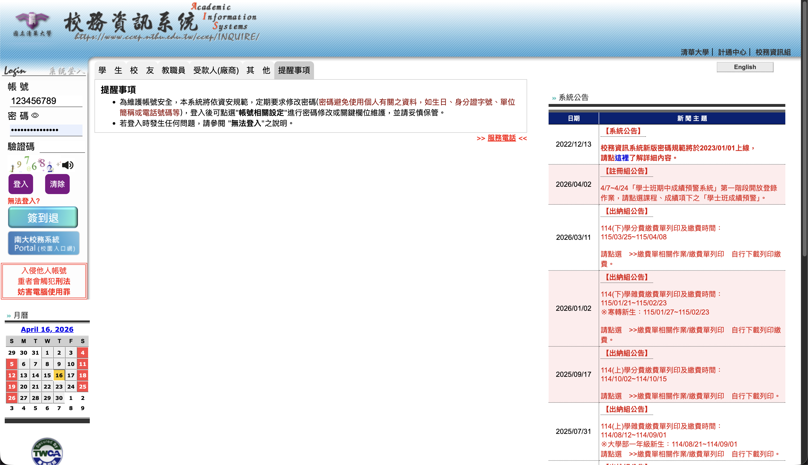
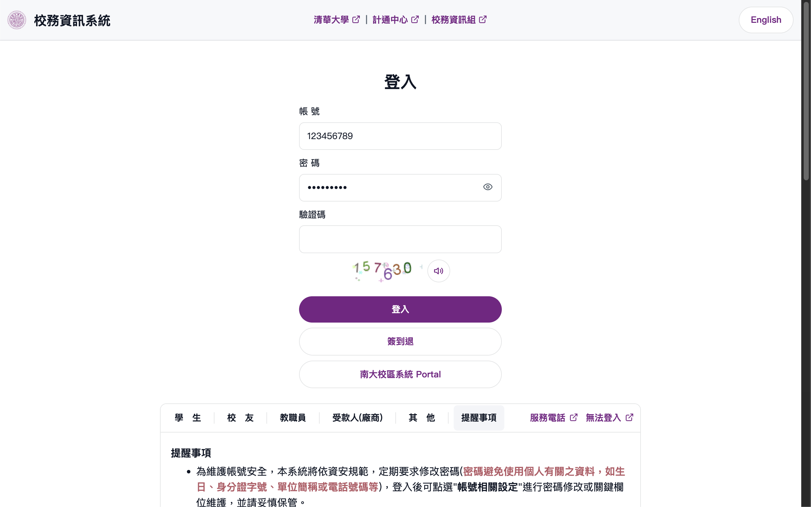
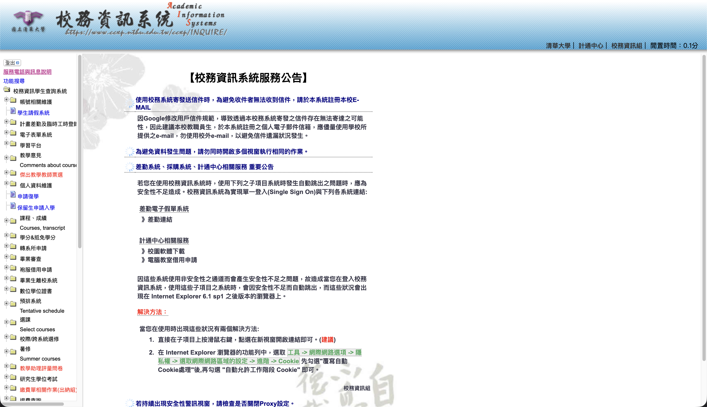
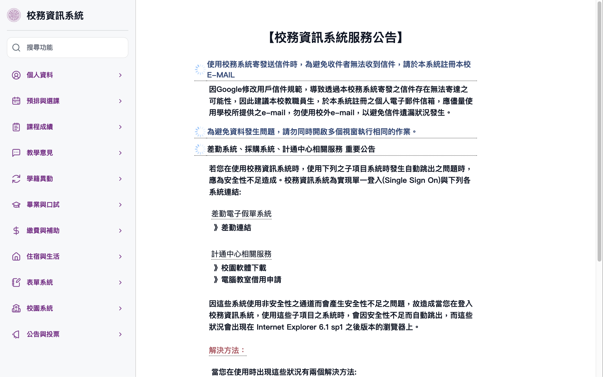
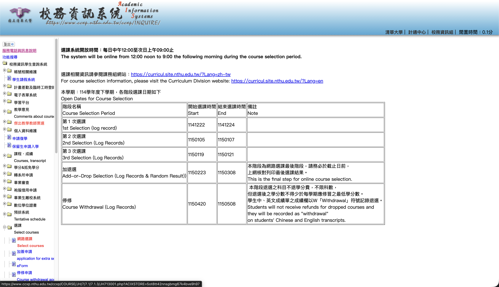
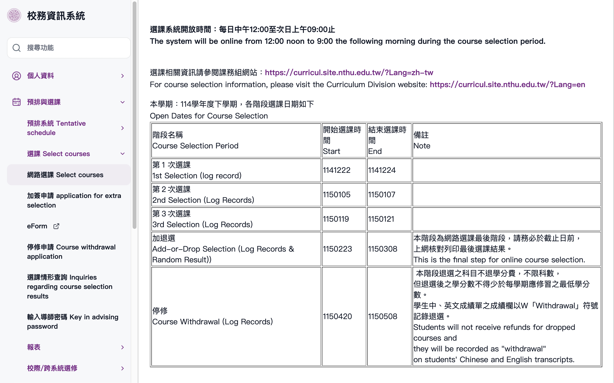

# ccxpLite
A minimalism theme pack Chrome extension for [NTHU CCXP](https://www.ccxp.nthu.edu.tw/ccxp/INQUIRE/).

## Installation
The extension is published on [Google Web Store](https://chromewebstore.google.com/detail/glcnfmnbmknbphfgjgbokbbchahmiakk?utm_source=item-share-cb).

## Demo

### Login Page
| Before | After |
|--------|-------|
|  |  |

### Menu layout
| Before | After |
|--------|-------|
|  |  |
|  |  |
